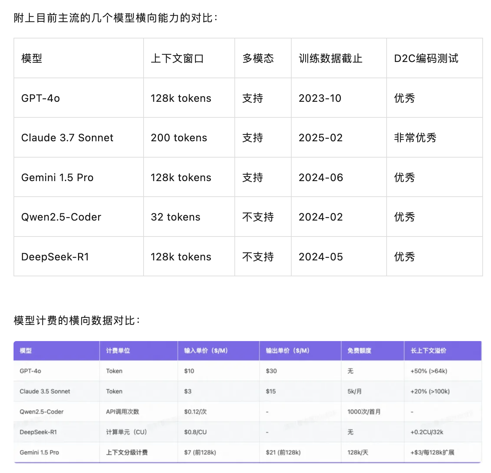

- 本文探讨了AI驱动的中后台前端研发实践，涵盖设计出码、接口定义转换、代码拟合、自动化测试等多个环节，通过具体案例展示了AI技术如何优化研发流程并提升效率。特别是在UI代码编写和接口联调阶段，并提出了设计出码（Design to Code）、接口定义到数据模型转换、代码拟合与调整、自动化测试回归等解决方案。同时，介绍了基于大语言模型的私有组件支持、RAG方案以及AI辅助的Code Review工具。最后，文章总结了试点结果，展示了AI在中后台场景下的应用效果，并展望了未来AI在研发流程中的深度整合与发展方向。
- # 01 背景
	- 从Anthropic今年2月发布的AI经济分析报告中可以看到，现阶段对社会各行各业来说，AI影响最大的仍然是计算软件和编程相关领域。在Claude中的所有对话中占比达到了37%，而在编程领域中，前端结合AI的空间是非常大的，因为业务前端是以一个个页面的形态交付，每个APP之间比较独立，不像后端应用中有着复杂的依赖的调用关系，更加适合AI去创作和理解。
	- 
	- 对于研发提效整体的思路是：在研发流程的各个阶段将问题进行拆解，在不同的流程中融入AI Agent能力进行研发节点的提效。在实践的过程中，沉淀产品化的能力，并最终落地形成AI驱动中后台研发解决方案。
	- ## 效率问题分析
		- 一个产品需求迭代从流程上我们一般从大的阶段上分为以下几个阶段：
		- 需求评估 -> 研发 -> 联调 -> 测试 -> 交付。
		- 从研发开始的流程再往下细分，不同的BU，不同的业务线由于使用的技术栈会存在部分的差异，以岗位的视角来看，一般可前端和后端可以拆分成以下几个流程：
		- 后端研发流程： PRD -> UI -> 技术评审/接口设计 -> 变更 -> 代码开发 -> 网关注册 -> 联调修改 -> 线上发布
		- **前端研发流程：PRD -> UI -> 技术评审/接口设计 -> 创建应用/变更 -> 开发 -> 联调 -> 线上发布**
		- 我们统计了团队内部的同学在一线业务需求研发的过程中，研发流程各个阶段的耗时比例，统计的方式主要是通过一线开发同学的主观反馈，因为一个需求研发过程并不是连贯的，大部分的同学手里同时都在做多个需求，并且也会由于各种客观原因，比如需求发生调整，业务以来信息还没有准备完成，人员抽调等等，很难进行精确的时效统计。
		- 研发流程的耗时分布统计：
			- 
		- （注：联调阶段包含联调的接口业务逻辑编写和调试，代码编写特指设计稿到前端交互代码的编码阶段）
		- 从上述的阶段分析来看，**对于研发效率主要能提升的节点在于UI代码编写和接口连调阶段。**
		- 到具体的反馈来看，联调的耗时问题的集中在：
		- 需求频繁变动：需求变更频繁，前后端需要快速响应调整，这对双方的沟通效率和代码灵活性提出了更高要求。
		- 文档滞后与不准确：接口文档常常无法及时更新或描述不够准确，导致前后端开发人员依据过时或错误的信息进行开发。
		- 接下来主要围绕这2个场景介绍一下我们在提效过程中的一些方案设计推导和实践。
- # 02 实践推导
	- ## 设计出码
		- 在设计出码的这个链路中，已经有很多的同类型的产品，有的产品会选择DSL的转化路线，比如Figma/mgdone的砖码插件，支付宝的WeaveFox，还有大部分低代码平台，虽然通过DSL中间层实现代码生成，相较于普通AI直出代码，优势在于程序化解析保障稳定性（防错机制）和统一DSL支撑跨语言协同。
		- 我们选择了AI直出代码的方案，主要考虑到几下几点：
			- DSL大部分是各个平台私有化的定制，缺少统一的标准化，对于模型学习的语料不足，或者说需要进行一定的预训练，而前端代码，无论是React/Vue都有海量的公共学习语料，随着模型的学习数据和理解力的不断提升，完全能达到初/中级前端程序员的编码能力。
			- 面向B端以中后台为主的页面和面向C端以导购营销为主的页面存在较大的差别，C端页面会存在各种营销氛围的叠加，一个商品坑位存在好几层的图层堆叠，使用DSL转换辅助可以保障AI出码的稳定性，但是**中后台的场景更偏功能性，每个区块分布都比较独立，使用最新的Anthropic Claude Sonnet3.7模型出码已经能以较高的还原度满足开发诉求**，以下是一个中后台的例子：
		- 设计稿：
			- 
		- AI出码：
			- 
	- ## 模型选择和提示词
		- ### 1 Claude 3.7 Sonnet
			- 在模型的选择方面，Claude 3.7 sonnet V2在代码方面的能力毋庸置疑，已经甩开了与OpenAI主流模型的差距,新版本在主动编码和工具使用方面有明显进步。
			- 在编码测试中，它将SWE-bench Verified的表现从33.4%提高到了49.0%，超过了所有公开的模型，不仅包括OpenAI o1-preview这样的推理模型，还有专为主动编码设计的系统。
			- **在我们内部的测试中，面向前端开发，无论是面向UI出码还是后续的代码拟合过程中，****Claude 3.7 sonnet 在横向的多种模型对比下均表现出最佳的代码生成能力，问题解决能力，架构设计能力**。以下是Anthropic官方在2025年2月25日发布的最新评分：
			- 
			- 
			- 
		- ### 2 提示词编写
			- 关于D2C出码提示词的编写，业内有很多的参考，比如：
			- cline提示词：https://github.com/cline/cline/blob/main/src/core/prompts/system.ts
			- bolt.new提示词：https://github.com/stackblitz/bolt.new/blob/main/app/lib/.server/llm/prompts.ts
			- 整体的思路都是比较类似的，大致的范式就是：角定定义(role)，系统约束(constraints)，还有具体的示例（few-shot）。
			- 角定定义和技能相关上的描述基本比较通用，比如“你的知识覆盖了各种编程语言、框架和最佳实践，特别注重React和现代Web开发。”，“具有React组件和Hooks的深度开发经验。”，“能够熟练的使用 Fusion(@alifd/next) 组件库进行页面的还原。”
			- 系统约束由于不同业务场景的不同需要，一般是由业务团队自己进行定制，
			- 明确性：react组件代码块仅支持一个文件，没有文件系统。用户不会为不同文件编写多个代码块，也不会在多个文件中编写代码。用户的习惯总是内联所有代码。
			- 约束性：所有的时间格式处理请都使用原生的 js 代码实现，不要使用任何时间处理库。
			- 场景化：不会为组件或库使用动态导入或懒加载。例如，`const Confetti = dynamic(...)`是不允许的。请使用`import Confetti from 'react-confetti'`。
			- 也可以包含一些通用的限制，例如：
				- 1. 避免使用 iframe、视频或其他媒体，因为它们不会在预览中正确渲染。
				- 2. 不会输出`<svg>`图标。总是使用 `@alifd/next` 库中的Icon的图标。
			- prompt示例：
				- ```apl
				  ```