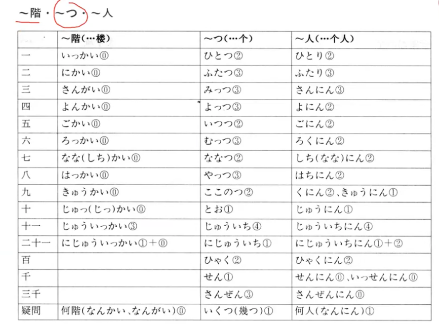

- [[语法]]
	- [[动词]]存在动词 ある　いる
		- 表示（某人、某物、某事）的存在，即“有……”
		- いる　表示有生命的 动物、人
		- ある　表示无生命的 包括植物
	- [[句型]]〜（地点）に〜（人/物）がある（いる）
		- 存在句，表示某地有某人（某物）
		- に表示存在的场所，前接地点名词
		- が提示主语
	- [[句型]]（疑问词）が〜ですか
		- 注意：疑问词做主语时，提问用が，回答也要用が
	- [[助词]]接续助词が　句子1+が，句子2
		- 顺接，无实际意义，一般前句是后句的前提或单纯的铺垫
	- [[助词]]Aと/やB
		- 两者都表示列举，と是完全列举，や是部分列举，常与など搭配
	- 数字+名词/动词
		- 数字+の+名词
		- 数字+动词
- [[日语死记硬背系列]]
	- 几层楼/几个/几人
		- 