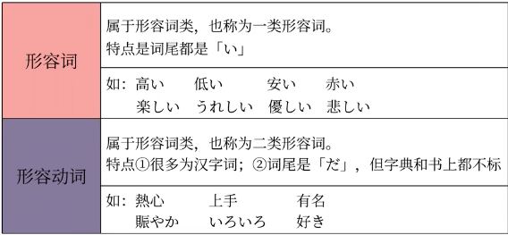
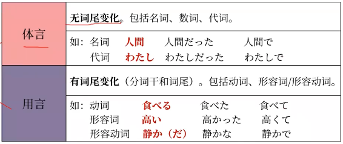
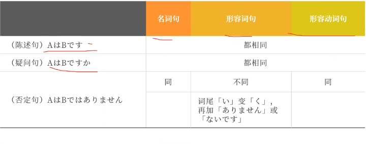
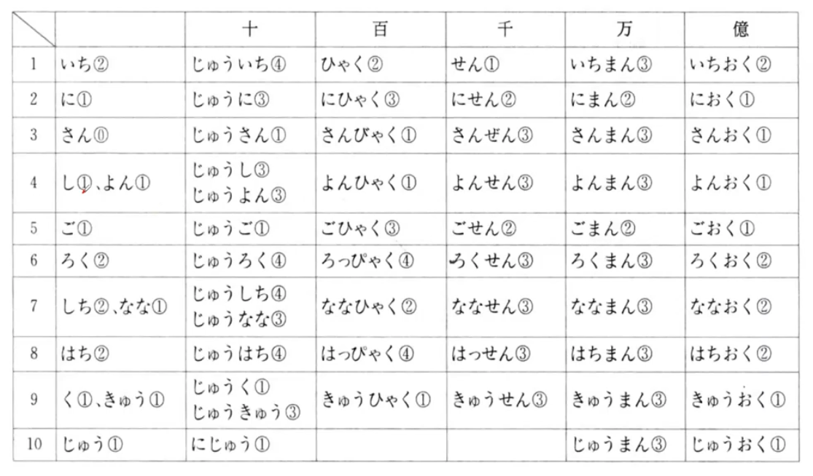

- [[语法]]
	- 日语里的形容词有两类：形容词与形容动词
		- {:height 206, :width 405}
		- 形容词的特点：**以い结尾**
		- 形容动词：本身是名词，当作形容词来用
	- [[句型]]AはBです A是B
		- 如果B是名词，那么这个句型叫名词谓语句，如果B是形容词/形容动词，则叫形容词/形容动词谓语句
	- [[句型]]AもBも〜です　句型的合并 A和B都……
	- 体言与用言
		- 
		- 体言：无词尾变化，如名词、数词、代词
		- 用言：有词尾变化，如动词、形容词/形容动词
	- 句型变化
		- 
		- 注意否定句里形容词的词尾要从い变成く，再加上ありません或ないです
		- 特别提示：形容词いい的否定是よくありません或者よくないです　 因为它在变形时是按照よい来变的
		- 形容词/形容动词的[[连体形]]
			- 形容词/形容动词修饰名词时：
				- 形容词原形+名词
				- 形容动词词干+な+名词
		- [[助词]]格助词  で
			- 表示范围
		- 距离某地远、近
			- 远：とおい　近：ちかい
			- 搭配：からとおい　からちかい　にちかい
			- から　助词，表示起点
			- に　助词，表示目的地，基准
		- [[助词]]语气助词 よ
			- 强调说话人的想法和情感，一般用于强调对方不知道的内容
			- ね：你知我知，找个底气　よ：你不知道，来，我告诉你
			- いいよ：告诉对方，我同意了
- [[日语死记硬背系列]]
	- 基数词
		- 
	- 年月
		- 
		-