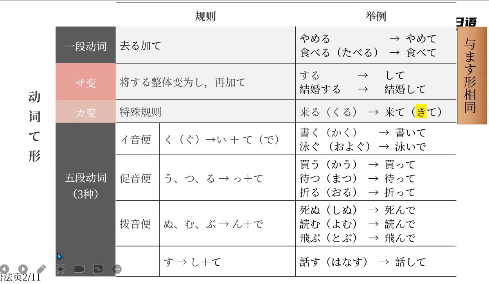

- [[语法]]
	- [[句型]]～ました · 〜ませんでした
		- 〜ました是ます的过去式
		- ませんでした是ます的过去否定式
	- [[动词]]动词て形
		- 
		- 这里面有个特例：行く（いく）实际上是促音变，即变为行って
	- [[句型]]动词（て形）+ている
		- 表示动作正在进行
		  logseq.order-list-type:: number
		- 表示状态的持续
		  logseq.order-list-type:: number
		- 这里动词的て形指变为て形后て前面的部分
		- ていました・ていません是ている的过去式/否定式
			- ていました 表示过去某段时间动作持续过，或状态存在过
			- ていません　表示没做某动作，或非某状态
			- 特别注意：动词知る（しる），意为知道，常用的两种用法：知っています（知道）＆知りません（不知道）　没有知っていません
	- [[助词]]格助词が　名词+が
		- 表示客观现象
	- [[助词]]接续助词，句子1+から，句子2
		- 表示原因、理由，句子1是原因
	- [[句型]]～へ〜を〜に行く
		- 表示去某个地方做某事
		- へ助词，表示目的或方向
		- を助词，表示宾语
		- に助词，表示目的
	-