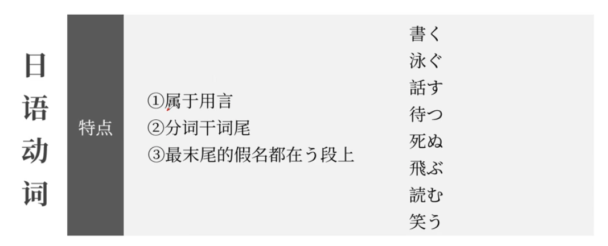
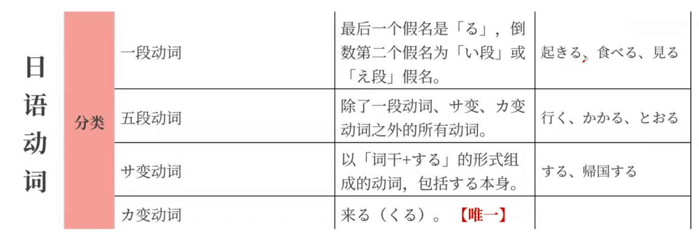
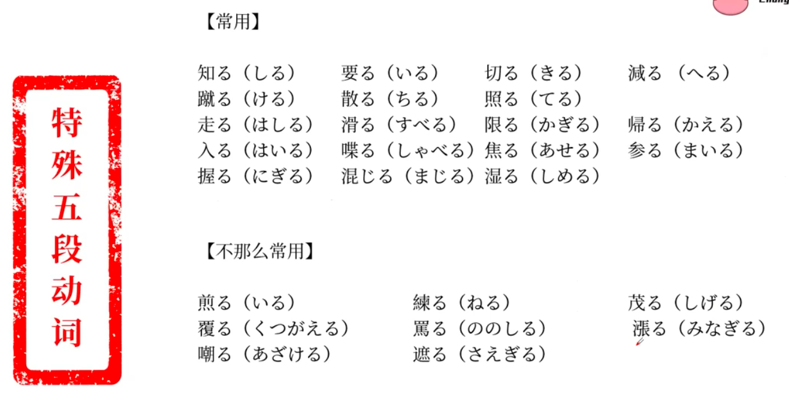
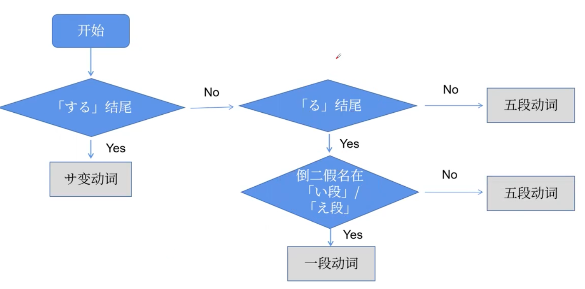
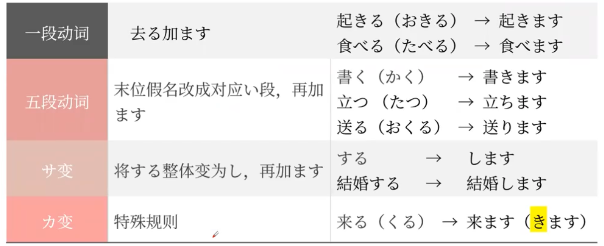
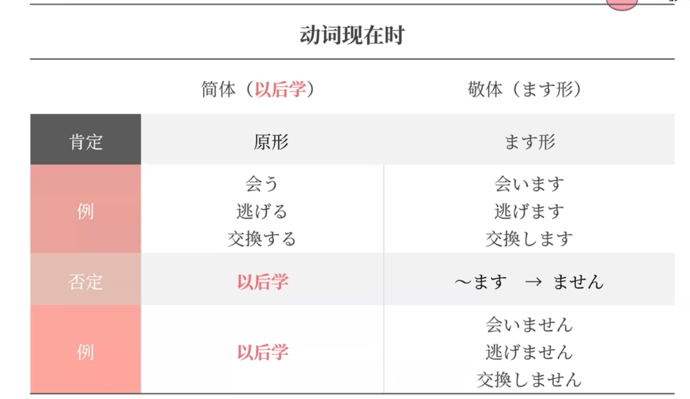
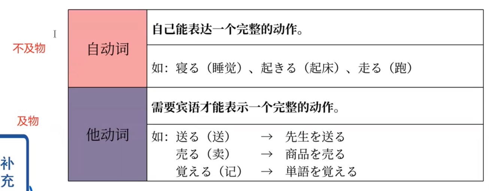
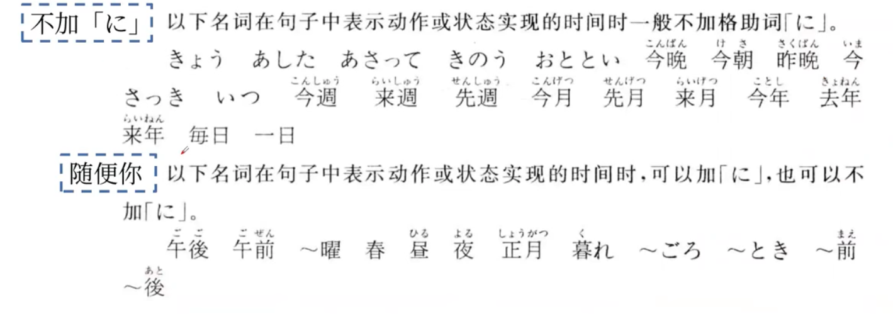
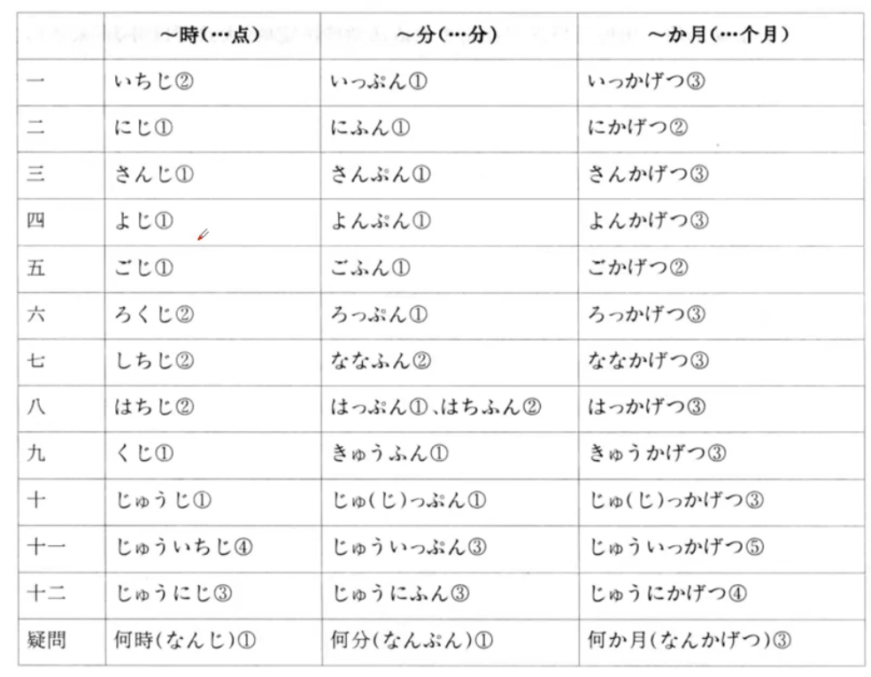
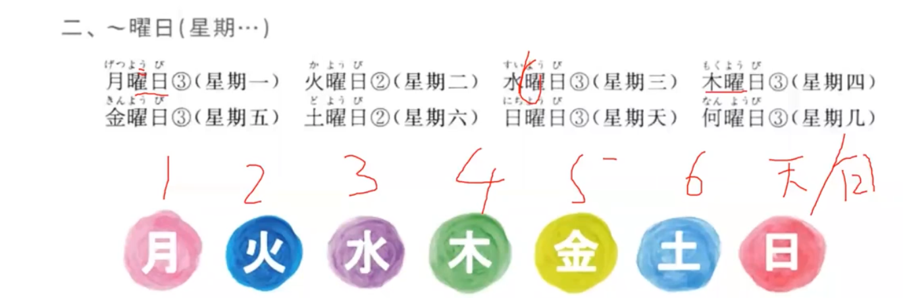

- [[语法]]
	- [[动词]]
		- 
		- 特点：1.属于用言；2.分词干词尾；3.最末尾的假名都在う段上
		- 
		- 特殊的五段动词（长得像一段动词的五段动词）
			- 
		- 日语动词类型判断流程图
			- 
		- 动词的ます形（敬体）
			- 
		- 动词的时态
			- 日语里的时态只有两种，过去时和非过去时（即现在和将来）
			- 
			- 补充：です的否定型是从である变来的，ではありません
		- 自动词与他动词
			- 
	- [[助词]] 宾格助词を　名词Aを动词B
		- 宾格助词，表示宾语
	- [[助词]] 格助词から　まで
		- から表示起点　まで表示终点
		- 可时间，可距离，可具体，可抽象
		- 可接です结句，可分开使用
	- [[助词]]格助词で 地点名词+で
		- 表示动作进行的场所
	- [[助词]]格助词に 时间名词+に
		- 表示动作发生的具体时间点
		- 
	- [[助词]]提示助词は/も
		- 提示主语、宾语、补语等等
	- [[助词]]格助词と 和
	- [[助词]]格助词へ
		- 作助词时读作e 表示方向、目的地
	- [[助词]]格助词に
		- 表示动作的目的地、着落点
		- 和へ的区别：へ重点在于移动的方向，に重点在于最终的着落点
	- [[句型]]动词（ます）+ませんか
		- 这里的动词ます形要去掉ます
		- 表示委婉地询问或邀请
- [[日语死记硬背系列]]
	- 时分月
		- 
	- 星期
		- 